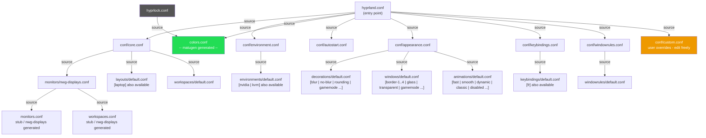
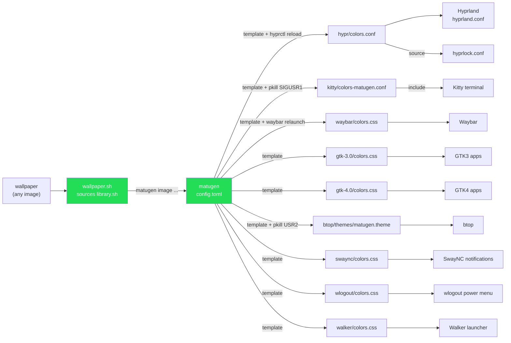
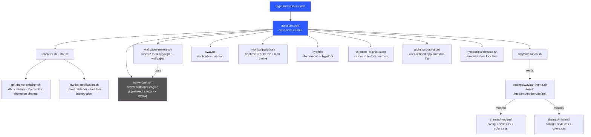

# ArchStoso Architecture Diagrams

Three diagrams covering the config source tree, color pipeline, and session startup.

---

## 1. Hyprland Config Source Tree

How `hyprland.conf` pulls in every module, and which variation presets are swappable.

> To swap a variation: edit the `source =` line in `appearance.conf`, `environment.conf`, or
> `keybindings.conf` to point at a different preset file. The `custom.conf` file is never
> overwritten by installs — put monitor, keyboard, and scaling overrides there.

---

## 2. Matugen Color Pipeline

How a wallpaper change propagates new colors to every component.

> All nine components update atomically from the same wallpaper color seed.
> SwayNC, wlogout, and Walker each have their own `colors.css` from a shared template.

---

## 3. Session Startup Chain

What runs when Hyprland starts (exec-once entries in `autostart.conf`).

> `swww-daemon` must start **before** `wallpaper-restore.sh`. The `sleep 2` in
> `wallpaper-restore.sh` handles the race condition.
> The `swww` binary is a symlink to `awww` — the Arch `extra` repo ships the fork with
> renamed binaries.
